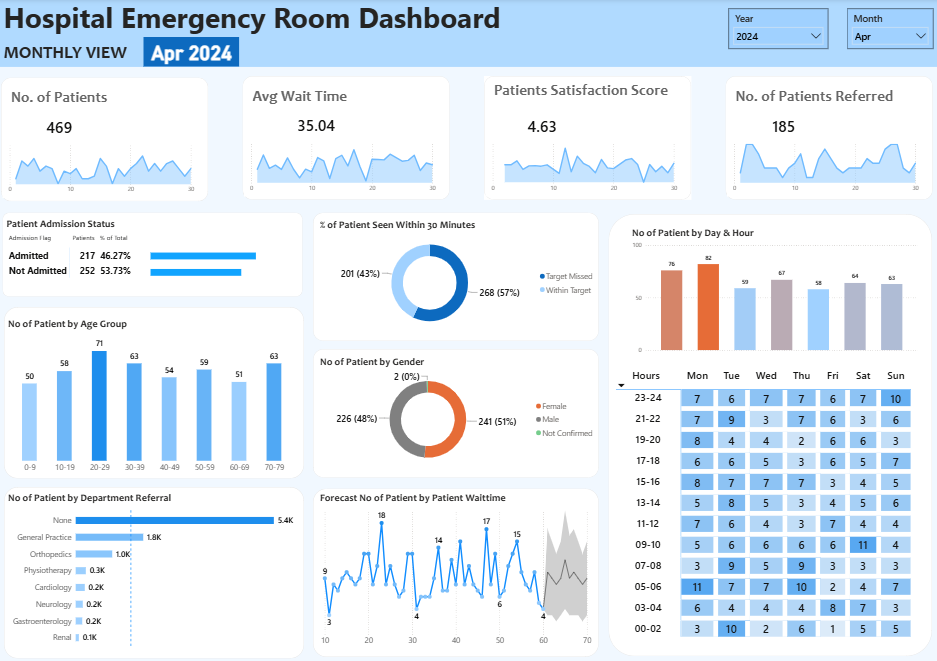
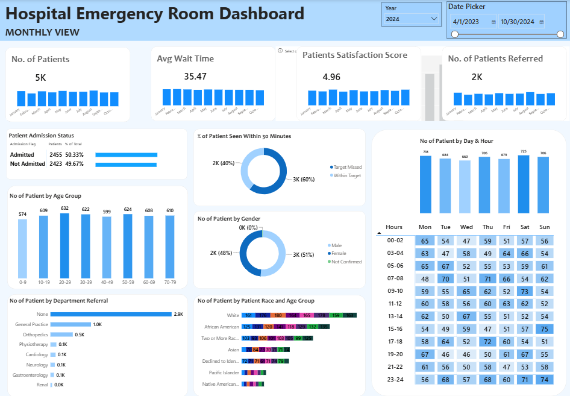
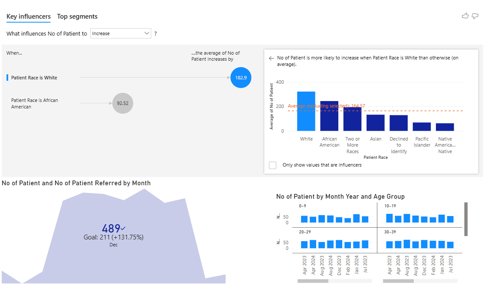
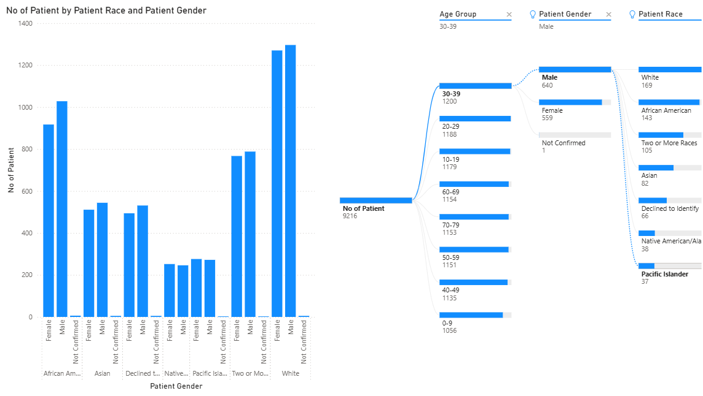

# Hospital Emergency Department Analytics

## Overview

A Power BI portfolio project focused on analyzing hospital emergency department operations, patient volume, wait times, admissions, referrals, satisfaction, and patient demographics.

The project uses sample healthcare data and demonstrates interactive dashboard design and Power BI analytical capabilities.

## Key Analysis Areas

- Patient volume and admission trends
- Average patient wait time
- Patient satisfaction
- Referral analysis
- Patient demographics
- Department-wise referrals
- Day and hour analysis
- Monthly performance trends
- Forecasting
- Key Influencers analysis
- Decomposition Tree analysis

## Power BI Features

- Interactive slicers
- KPI cards
- Drill-down and filtering
- Key Influencers
- Decomposition Tree
- Forecasting
- Matrix and conditional-formatting visuals
- Time-based analysis
- Interactive report navigation

## Report Pages

### Monthly View
Monthly analysis of patient volume, wait time, satisfaction, referrals, admissions, demographics and hourly patient patterns.

### Consolidated View
Aggregated view of emergency department performance across the selected reporting period.

### Key Influencers & KPI
Analysis of factors influencing patient volume along with KPI and trend analysis.

### Decomposition Tree
Interactive decomposition of patient volume across demographic dimensions.

## Tools & Technologies

- Power BI Desktop
- DAX
- Power Query
- Data Modeling
- Data Visualization

## Skills Demonstrated

- Data modeling and relationship design
- DAX measures and calculations
- Power Query transformations
- KPI and trend analysis
- Interactive dashboard development
- Forecasting and analytical visuals
- Key Influencers and Decomposition Tree
- Slicer-driven report interaction

## Project Note

This is a portfolio/learning project developed using sample healthcare data. It is not based on confidential patient, hospital, employer, or client data.

## Dashboard Preview

### Monthly View

### Consolidated View

### Key Influencers & KPI

### Decomposition Tree

